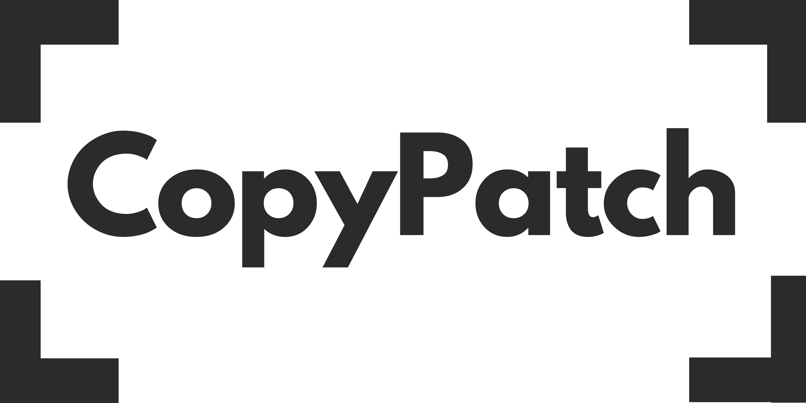
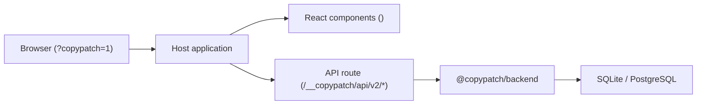

# CopyPatch

> Modern, same-origin inline copy editor for React applications.

[](https://github.com/Woffluon/CopyPatch/actions/workflows/ci.yml)
[](packages)
[](LICENSE)
[](package.json)
[](https://copypatch.vercel.app)

[English](README.md) | [Türkçe](README.tr.md)

<picture>
  <source media="(prefers-color-scheme: dark)" srcset="apps/site/public/banner-dark.png">
  
</picture>

---

CopyPatch gives teams and clients the ability to edit production copy directly on the page without touching code or opening a separate CMS.

Mark editable strings with React components, mount the embedded backend inside your host application, and let authorized editors update content on-demand by appending `?copypatch=1` to any URL.

---

## Documentation portal

| Category | Destination | Description |
| :--- | :--- | :--- |
| **Core & React** | [`@copypatch/core`](packages/core)<br>[`@copypatch/react`](packages/react) | Shared types, contracts, `<EditableText>`, `<CopyPatchProvider>`, and editor overlay. |
| **Backend & Node** | [`@copypatch/backend`](packages/backend)<br>[`@copypatch/node`](packages/node) | Storage-independent HTTP controller, Express/Fastify/Hono adapters, and project CLI. |
| **Persistence** | [`@copypatch/storage-sqlite`](packages/storage-sqlite)<br>[`@copypatch/storage-postgres`](packages/storage-postgres) | SQLite (single-node) and PostgreSQL (distributed horizontal clusters) adapters. |
| **Next.js** | [`@copypatch/next`](packages/next) | Next.js App Router route handlers, server snapshot pre-fetching, and provider wrappers. |
| **Architecture** | [`docs/architecture.md`](docs/architecture.md) | Runtime shape, boundaries, data flow, and documentation governance. |
| **Security** | [`docs/threat-model.md`](docs/threat-model.md)<br>[`SECURITY.md`](SECURITY.md) | Threat boundary, authentication, CSRF, and disclosure policy. |
| **Examples** | [`examples/`](examples) | Runnable reference integrations for Next.js, Astro, React Router, and Vite. |
| **Documentation site** | [English docs](https://copypatch.vercel.app/docs)<br>[Türkçe dokümanlar](https://copypatch.vercel.app/tr/docs) | Framework guides, API reference, operations, and local full-text search. |

---

## Architecture at a glance

CopyPatch runs embedded inside your application runtime. It does not require a standalone API server, additional open ports, reverse proxies, or external CORS configuration:



### Key Architectural Pillars

- **Same-origin deployment:** The API route mounts directly under `/__copypatch/api/v2`. All network requests stay on the origin, removing CORS configuration and external attack vectors.
- **Zero visitor bundle bloat:** Public visitors receive only lightweight React text tags. The visual editor, diff views, and authentication modals load dynamically only when `?copypatch=1` is requested.
- **Server snapshot rendering:** Server components (RSC) and SSR routes read published copy directly from the backend, avoiding layout shifts and client hydration waterfalls.
- **Revision coordination:** Built-in atomic compare-and-swap mechanics prevent draft overwrites and race conditions during concurrent editing sessions.

---

## Quick start

### 1. Install packages

```bash
pnpm add @copypatch/core @copypatch/react @copypatch/backend @copypatch/storage-sqlite @copypatch/node @copypatch/next
```

### 2. Wrap your layout and tag editable copy

```tsx
import { NextCopyPatchProvider, EditableText } from '@copypatch/next';
import { readPublishedSnapshot } from '@copypatch/next/server';
import { backend } from '@/lib/copypatch';

export default async function Layout({ children }: { children: React.ReactNode }) {
  const snapshot = await readPublishedSnapshot(backend, 'en');

  return (
    <NextCopyPatchProvider locale="en" initialSnapshot={snapshot}>
      <header>
        <EditableText contentKey="header.title" as="h1">
          Welcome to our product
        </EditableText>
      </header>
      <main>{children}</main>
    </NextCopyPatchProvider>
  );
}
```

### 3. Open the inline editor

Navigate to any page with `?copypatch=1` (for example, `http://localhost:3000/?copypatch=1`). Authenticate with your configured passphrase, edit copy directly on the page, and save drafts or publish changes instantly.


## Monorepo packages

All public packages publish in lockstep versioning (`3.0.0`):

| Package | Version | Description | Readme |
| :--- | :--- | :--- | :--- |
| [`@copypatch/core`](packages/core) | `3.0.0` | Shared contracts, constants, schemas, and persistence interfaces. | [README](packages/core/README.md) |
| [`@copypatch/react`](packages/react) | `3.0.0` | Provider, hooks, `<EditableText>`, and on-demand editor runtime. | [README](packages/react/README.md) |
| [`@copypatch/backend`](packages/backend) | `3.0.0` | Storage-agnostic HTTP handler, auth contract, and mutation engine. | [README](packages/backend/README.md) |
| [`@copypatch/storage-sqlite`](packages/storage-sqlite) | `3.0.0` | SQLite adapter for single-node and local deployments. | [README](packages/storage-sqlite/README.md) |
| [`@copypatch/storage-postgres`](packages/storage-postgres) | `3.0.0` | PostgreSQL adapter for horizontal multi-instance clusters. | [README](packages/storage-postgres/README.md) |
| [`@copypatch/node`](packages/node) | `3.0.0` | Adapters for Express, Fastify, Hono, Node HTTP, and `copypatch` CLI. | [README](packages/node/README.md) |
| [`@copypatch/next`](packages/next) | `3.0.0` | Next.js App Router route handlers, RSC snapshot readers, and provider. | [README](packages/next/README.md) |

---

## Choose your framework

CopyPatch provides tested, production-grade example implementations for major frameworks:

- [**Next.js App Router Guide**](examples/next-app/README.md): App Router catch-all route, server component snapshot pre-fetching, and SQLite setup.
- [**Astro SSR + React Guide**](examples/astro-ssr-react/README.md): Node adapter integration with Astro SSR endpoints and island hydration.
- [**React Router / Remix Guide**](examples/react-router/README.md): Server loader snapshot resolution and route action handling.
- [**Vite + Express / Node Guide**](examples/vite-node/README.md): Colocated backend with Express or native Node.js HTTP server.
- [**Vite Single-Page App Guide**](examples/vite-react/README.md): Client-only SPA integration with remote backend mount.

---

## CLI quick reference

The `@copypatch/node` package includes the `copypatch` CLI utility:

```bash
# Scaffold initial configuration and route mounts
pnpm exec copypatch init --framework next --storage sqlite

# Generate an Argon2id passphrase hash securely from stdin
printf 'your-secure-passphrase' | pnpm exec copypatch hash --stdin

# Inspect the generated configuration and CopyPatch environment variables
pnpm exec copypatch doctor
```

---

## Security and access control

- **Passphrase Authentication:** Built-in Argon2id password hashing with time-safe verification.
- **Session Cookies:** HTTP-only, secure, SameSite cookies hold high-entropy tokens; persistence stores token hashes rather than raw tokens.
- **CSRF Defense:** Mutation requests require the `x-copypatch-csrf` header matching the active session.
- **Role Hierarchy:** Enforces `editor` (save and discard drafts) and `publisher` (promote drafts to live copy) permissions.
- **Custom Auth Adapters:** Integrate with existing session stores (NextAuth, Clerk, Lucia, Supabase) via custom auth adapters.

See the full [Threat Model](docs/threat-model.md) and [Security Policy](SECURITY.md) for details.

---

## Contributing and release workflow

We welcome contributions! Please review [CONTRIBUTING.md](CONTRIBUTING.md) for repository guidelines and local setup instructions.

```bash
pnpm install --frozen-lockfile   # Install dependencies
pnpm build                      # Build all packages
pnpm typecheck                  # Validate TypeScript across all packages
pnpm test                       # Run Vitest suite and release contracts
pnpm test:e2e                   # Run Playwright E2E browser tests
```

### Conventional Commits & Lockstep Releases

All versioned changes follow the lockstep release policy. Prepare commits using:

```bash
pnpm release:prepare -- "feat: describe your feature"
```

---

## License

MIT License. See [LICENSE](LICENSE) for details.
