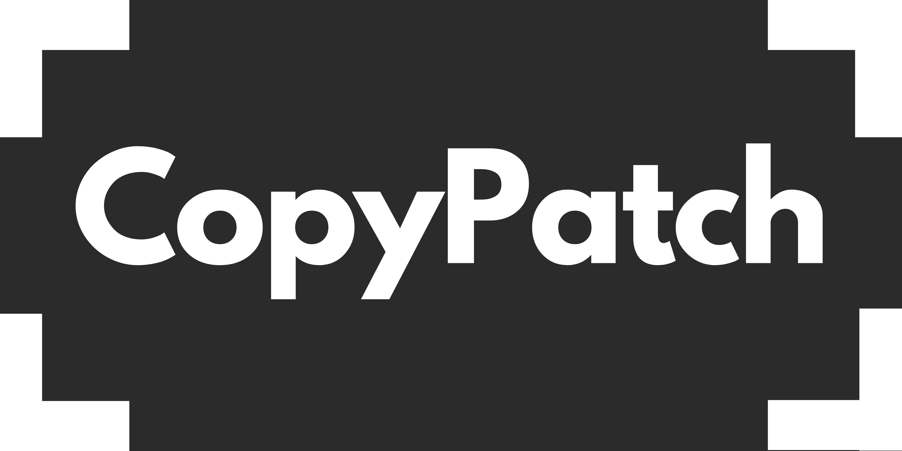
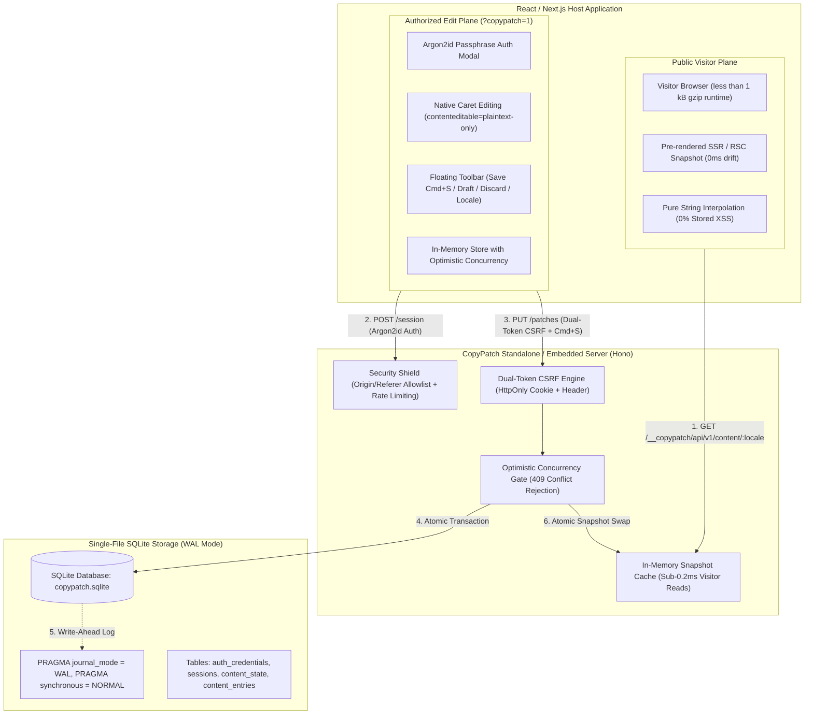

<p align="center">
  <picture>
    <source media="(prefers-color-scheme: dark)" srcset="apps/site/public/banner-dark.png">
    <source media="(prefers-color-scheme: light)" srcset="apps/site/public/banner-white.png">
    
  </picture>
</p>

<p align="center">
  <strong>Self-hosted inline copy editing for React and Next.js applications.</strong><br>
  Let teammates and clients edit copy directly on the live page without touching code or risking layouts.
</p>

<p align="center">
  <a href="LICENSE"></a>
  <a href="https://github.com/woffluon/CopyPatch/actions"></a>
  
  =20">
  
  
  
</p>

<p align="center">
  <a href="#why-copypatch">Why CopyPatch</a> •
  <a href="#architecture">Architecture</a> •
  <a href="#quick-start-react--vite">Quick Start (React)</a> •
  <a href="#nextjs-app-router-rsc">Next.js (RSC)</a> •
  <a href="#package-matrix">Packages</a> •
  <a href="#production-recipes">Production Recipes</a> •
  <a href="#security-invariants">Security</a> •
  <a href="#documentation">Docs</a>
</p>

---

## Why CopyPatch?

Most content tools introduce unacceptable tradeoffs for engineering teams:
- **Headless CMS platforms** (Sanity, Contentful, Strapi) force rigid schema modeling, external dashboard context switching, heavy SDKs (15 to 50 kB), and monthly API fees for simple copy changes.
- **Visual page builders** (Webflow, Framer, Wix) take away full code ownership, export bloated HTML/CSS, and break design system constraints.
- **Hardcoded Git commits** require developers to open pull requests, rebase branches, and run full CI/CD deployment pipelines just to fix a single headline typo.

**CopyPatch provides a surgical third path:** developers write standard React components and wrap editable text in `<EditableText>`. When an authorized team member opens the site with `?copypatch=1`, they log in with an Argon2id passphrase, click directly into the text, type naturally with native caret preservation, and save. The underlying layout, CSS, and component logic remain strictly untouched.



---

## Architectural Comparison

| Dimension | CopyPatch | Traditional Headless CMS | Visual Page Builder |
| :--- | :--- | :--- | :--- |
| **Editing Context** | Inline on actual live website (`?copypatch=1`) | Disconnected admin dashboard | Drag-and-drop proprietary canvas |
| **Code Ownership** | **100% developer React & CSS code** | Rigid schema bindings | Vendor-generated markup |
| **Visitor Bundle** | **< 1 kB gzip** (0.2 kB core runtime) | 15 to 50 kB CMS SDK | 150 to 500+ kB runtime scripts |
| **Security Invariant** | **Strict plain text (0% Stored XSS)** | HTML/Markdown injection risks | Arbitrary script risks |
| **Hydration Drift** | **0ms (Exact SSR snapshot sync)** | Common prop/async fetch drift | N/A (Server render bypass) |
| **Data Sovereignty** | **Self-hosted single SQLite file** | Third-party cloud vendor lock-in | Hosted vendor cloud |
| **Time to First Edit** | **< 2 minutes (1 component wrap)** | Hours of schema configuration | Full project migration |
| **Licensing** | **100% Free & MIT Open-Source** | Monthly seat / bandwidth fees | Domain subscription pricing |

---

## Core Invariants

1. **Strict Plain-Text Invariant**: CopyPatch accepts and stores plain strings only. HTML tags, script injection payloads, and Markdown are normalized as inert text, guaranteeing immunity from Stored Cross-Site Scripting (XSS).
2. **Zero Hydration Mismatch**: `@copypatch/next` pre-fetches published snapshots during server rendering (RSC) so client hydration matches server markup with 0ms drift.
3. **Lazy-Loaded Editor Plane**: The editor UI, authentication modal, and toolbar (~12 kB gzip) load dynamically only when `?copypatch=1` is explicitly present in the URL.
4. **Optimistic Concurrency**: Revisions are tracked per locale (`publishedRevision`, `draftRevision`). Conflicting concurrent edits are rejected with HTTP `409 Conflict`.
5. **Zero External Dependencies**: Operates on a single-file SQLite database with Write-Ahead Logging (WAL) and zero external database services.

---

## Package Matrix

| Package | Version | Description | Target Environment |
| :--- | :--- | :--- | :--- |
| [`@copypatch/react`](packages/react) | `0.1.0` | React context provider, `<EditableText>`, and hooks | React / Vite / Next.js Client |
| [`@copypatch/core`](packages/core) | `0.1.0` | Shared interfaces, normalization, and constants | Universal (Node.js / Browser) |
| [`@copypatch/next`](packages/next) | `0.1.0` | Next.js App Router (RSC) snapshot pre-rendering | Next.js Server & Client |
| [`@copypatch/server`](packages/server) | `0.1.0` | Hono HTTP server, SQLite WAL storage, and CLI | Node.js Server (`>= 20`) |

---

## Quick Start (React & Vite)

### 1. Install Dependencies

```bash
pnpm add @copypatch/react @copypatch/core
pnpm add -D @copypatch/server
```

### 2. Initialize Database & Set Editor Passphrase

```bash
npx copypatch init --db ./copypatch.sqlite
```

### 3. Start CopyPatch API Server

```bash
npx copypatch serve --port 4040 --db ./copypatch.sqlite --origin http://localhost:5173 --mode direct
```

### 4. Wrap React App with `CopyPatchProvider`

```tsx
import React, { useState } from 'react';
import { CopyPatchProvider, EditableText, useCopyPatch } from '@copypatch/react';

export function App() {
  const [locale, setLocale] = useState<'en' | 'tr'>('en');
  const ctaText = useCopyPatch('home.cta.button', 'Get Started');

  return (
    <CopyPatchProvider locale={locale} apiBase="/__copypatch/api/v1">
      <header>
        <EditableText contentKey="nav.brand" as="span">
          Acme Studio
        </EditableText>
      </header>

      <main>
        {/* Single-line headline with native caret editing */}
        <EditableText contentKey="home.hero.title" as="h1">
          Build something people actually use.
        </EditableText>

        {/* Multiline paragraph */}
        <EditableText contentKey="home.hero.subtitle" as="p" allowLineBreaks={true}>
          Fast, accessible, and self-hosted inline copy editing for React teams.
        </EditableText>

        <button type="button">{ctaText}</button>
      </main>
    </CopyPatchProvider>
  );
}
```

### 5. Start Editing

Open `http://localhost:5173?copypatch=1` in your browser, enter your passphrase, click any text, and edit. Press `Cmd+S` or `Ctrl+S` to save.

---

## Next.js App Router (RSC)

Pre-render published snapshots on the server to ensure perfect SEO indexing and zero hydration warnings:

```tsx
// app/[locale]/page.tsx (Server Component)
import { NextCopyPatchProvider, EditableText } from '@copypatch/next';
import { fetchServerSnapshot } from '@copypatch/next/server';

interface PageProps {
  params: Promise<{ locale: string }>;
}

export default async function Page({ params }: PageProps) {
  const { locale } = await params;

  // Pre-fetch published snapshot at SSR/build time
  const snapshot = await fetchServerSnapshot(locale, {
    apiBaseUrl: process.env.COPYPATCH_INTERNAL_URL || 'http://127.0.0.1:4040',
    next: {
      revalidate: 60,
      tags: [`copypatch-snapshot-${locale}`],
    },
  });

  return (
    <NextCopyPatchProvider
      locale={locale}
      apiBase="/__copypatch/api/v1"
      initialSnapshot={snapshot}
    >
      <main>
        <EditableText contentKey="hero.title" as="h1">
          Next.js Pre-rendered Headline
        </EditableText>
      </main>
    </NextCopyPatchProvider>
  );
}
```

Proxy the CopyPatch API through `next.config.mjs` to keep same-origin cookies:

```javascript
// next.config.mjs
/** @type {import('next').NextConfig} */
const nextConfig = {
  async rewrites() {
    return [
      {
        source: '/__copypatch/api/:path*',
        destination: 'http://127.0.0.1:4040/__copypatch/api/:path*',
      },
    ];
  },
};

export default nextConfig;
```

---

## Deep Dives & Technical Architecture

<details>
<summary><strong>Sub-0.2ms In-Memory Snapshot & SQLite WAL Architecture</strong></summary>

### Memory Cache & Write-Ahead Logging

Public visitors never hit disk I/O. When `@copypatch/server` boots, it loads published snapshots into an in-memory map. When a visitor requests `GET /__copypatch/api/v1/content/:locale`, the server responds directly from memory in under 0.2ms.

When an authorized editor saves content:
1. A transaction begins in SQLite (WAL mode).
2. Content records are inserted or updated in `content_entries`.
3. Revision numbers in `content_state` increment atomically.
4. The transaction commits to the WAL file with `PRAGMA synchronous = NORMAL`.
5. The in-memory cache pointer is atomically swapped.
6. Public visitors immediately receive the updated snapshot on subsequent requests.

</details>

<details>
<summary><strong>Cryptographic Hardening (Argon2id, Dual-Token CSRF, Host-Prefix Cookies)</strong></summary>

### Security Architecture

- **Argon2id Passphrase Hashing**: Uses RFC 9106 memory-hard parameters (19 MiB RAM cost, 2 iterations, 1 parallelism lane). Resists GPU and ASIC brute-force attacks.
- **256-bit Session Entropy**: Tokens are generated via `crypto.randomBytes(32)` and stored in SQLite hashed with SHA-256. Database leaks do not expose active tokens.
- **Dual-Token CSRF**: State-mutating endpoints require both a valid `HttpOnly` session cookie and an in-memory `x-copypatch-csrf` header. Cross-origin scripts cannot access this header.
- **Origin Isolation**: Mutating endpoints enforce `Origin` and `Referer` allowlist checks against `--origin`.
- **`__Host-` Cookie Scoping**: In production HTTPS environments, cookies enforce `__Host-` prefixes, preventing subdomain injection.

</details>

<details>
<summary><strong>Zero-Downtime SQLite S3 Replication via Litestream</strong></summary>

Because CopyPatch runs SQLite in WAL mode, you can stream continuous real-time backups to AWS S3, Cloudflare R2, or MinIO using Litestream:

```yaml
# /etc/litestream.yml
dbs:
  - path: /data/copypatch.sqlite
    replicas:
      - type: s3
        bucket: my-copypatch-backups
        path: production/copypatch.sqlite
        endpoint: s3.eu-central-1.amazonaws.com
        access-key-id: ${AWS_ACCESS_KEY_ID}
        secret-access-key: ${AWS_SECRET_ACCESS_KEY}
        retention: 720h
```

</details>

---

## Production Recipes

### 1. Docker & Docker Compose

```yaml
# docker-compose.yml
version: "3.8"

services:
  copypatch:
    image: node:20-alpine
    working_dir: /app
    command: npx copypatch serve --port 4040 --db /data/copypatch.sqlite --origin https://my-site.com --mode direct
    restart: unless-stopped
    ports:
      - "127.0.0.1:4040:4040"
    environment:
      - NODE_ENV=production
    volumes:
      - copypatch_data:/data

volumes:
  copypatch_data:
    driver: local
```

### 2. Caddy Reverse Proxy

```nginx
# Caddyfile
my-site.com {
    encode gzip zstd

    # Route CopyPatch API directly to backend container
    handle /__copypatch/api/v1/* {
        reverse_proxy 127.0.0.1:4040
    }

    # Main frontend application (Next.js / Node / SPA)
    handle {
        reverse_proxy 127.0.0.1:3000
    }
}
```

### 3. Linux systemd Service Unit

```ini
# /etc/systemd/system/copypatch.service
[Unit]
Description=CopyPatch Standalone Server
After=network.target

[Service]
Type=simple
User=copypatch
Group=copypatch
WorkingDirectory=/var/www/copypatch
ExecStart=/usr/bin/node packages/server/dist/cli/bin.js serve --port 4040 --db /var/lib/copypatch/copypatch.sqlite --origin https://my-site.com
Restart=always
RestartSec=10
Environment=NODE_ENV=production

# Hardening Directives
NoNewPrivileges=true
ProtectSystem=strict
ProtectHome=true
ReadWritePaths=/var/lib/copypatch
PrivateTmp=true

[Install]
WantedBy=multi-user.target
```

---

## CLI Command Suite

```bash
# Initialize SQLite database schema and configure editor passphrase
npx copypatch init --db ./copypatch.sqlite

# Start the HTTP API server
npx copypatch serve --port 4040 --db ./copypatch.sqlite --origin "http://localhost:5173,https://my-site.com" --mode direct

# Invalidate active sessions and rotate administrative passphrase
npx copypatch password --db ./copypatch.sqlite

# Apply pending database schema migrations
npx copypatch migrate --db ./copypatch.sqlite
```

---

## Documentation

- [System Architecture](docs/architecture.md)
- [Threat Model & Security](docs/threat-model.md)
- [Contributing Guide](CONTRIBUTING.md)
- [Security Policy](SECURITY.md)

---

## License

MIT License (c) 2026 Efe Arabaci.
