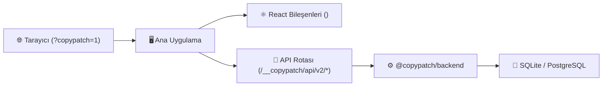

# 📝 CopyPatch

> React uygulamaları için modern ve aynı köken (same-origin) satır içi metin düzenleyici.

[](https://github.com/Woffluon/CopyPatch/actions/workflows/ci.yml)
[](packages)
[](LICENSE)
[](package.json)
[](https://copypatch.vercel.app)

[English](README.md) • [Türkçe](README.tr.md)

---

CopyPatch, ekiplere ve müşterilere harici bir CMS arayüzüne veya kod düzenlemesine ihtiyaç duymadan, doğrudan canlı web sayfası üzerinde metinleri düzenleme imkanı sağlar.

Düzenlenebilir alanları React bileşenleriyle işaretleyin, gömülü backend modülünü uygulamanıza bağlayın ve yetkili editörlerin `?copypatch=1` parametresiyle metinleri canlıda güncellemesini sağlayın.

---

## 🧭 Navigasyon Portalı

| Kategori | Bağlantı | Açıklama |
| :--- | :--- | :--- |
| 📦 **Core ve React** | [`@copypatch/core`](packages/core)<br>[`@copypatch/react`](packages/react) | Ortak tipler, şemalar, `<EditableText>`, `<CopyPatchProvider>` ve düzenleyici katmanı. |
| ⚙️ **Backend ve Node** | [`@copypatch/backend`](packages/backend)<br>[`@copypatch/node`](packages/node) | Depolamadan bağımsız HTTP denetleyicisi, Express/Fastify/Hono adaptörleri ve proje CLI aracı. |
| 🗄️ **Kalıcılık (Depolama)** | [`@copypatch/storage-sqlite`](packages/storage-sqlite)<br>[`@copypatch/storage-postgres`](packages/storage-postgres) | SQLite (tek sunucu/yerel) ve PostgreSQL (yatayda ölçeklenen kümeler) depolama adaptörleri. |
| ⚡ **Next.js** | [`@copypatch/next`](packages/next) | Next.js App Router rota işleyicileri, sunucuda snapshot okuma yardımcıları ve sağlayıcı. |
| 🏛️ **Mimari** | [`docs/architecture.tr.md`](docs/architecture.tr.md) | Çalışma zamanı yapısı, paket sınırları, veri akışı ve dökümantasyon kuralları. |
| 🛡️ **Güvenlik** | [`docs/threat-model.tr.md`](docs/threat-model.tr.md)<br>[`SECURITY.tr.md`](SECURITY.tr.md) | Güvenlik modeli, Argon2id şifreleme, CSRF başlıkları ve güvenlik açığı bildirim politikası. |
| 🚀 **Örnekler** | [`examples/`](examples) | Next.js, Astro, React Router ve Vite için çalıştırılabilir referans projeler. |
| 🌐 **Canlı Demo ve Site** | [`apps/site`](apps/site) | Resmi Astro dökümantasyon ve etkileşimli canlı gösterim sitesi. |

---

## 🏗️ Genel Mimari

CopyPatch uygulamanızın kendi çalışma ortamında gömülü çalışır. Harici bir API sunucusu, açık portlar veya CORS yapılandırması gerektirmez:



### Temel Mimari Prensipler

- **Aynı köken (Same-origin) mimarisi:** API rotası doğrudan `/__copypatch/api/v2` altında çalışır. Tüm istekler sayfanın kendi kökeninde kalır, CORS risklerini ortadan kaldırır.
- **Ziyaretçiler için sıfır paket yükü:** Normal ziyaretçiler yalnızca hafif metin etiketleri alır. Düzenleyici paneli ve kimlik doğrulama modülleri sadece `?copypatch=1` çağrıldığında dinamik yüklenir.
- **Sunucu anlık görüntüsü (Snapshot) ile render:** Sunucu bileşenleri (RSC) ve SSR rotaları yayınlanmış metinleri doğrudan okur, layout kayması ve istemci şelalelerini engeller.
- **Revizyon koordinasyonu:** Dahili atomik karşılaştır-ve-değiştir (compare-and-swap) mekanizması eşzamanlı düzenlemelerde çakışmaları önler.

---

## ⚡ 3 Adımda Hızlı Başlangıç

### 1. Paketleri yükleyin

```bash
pnpm add @copypatch/core @copypatch/react @copypatch/backend @copypatch/storage-sqlite @copypatch/next
```

### 2. Layout bileşeninizi sarmalayın ve metinleri etiketleyin

```tsx
import { NextCopyPatchProvider, EditableText } from '@copypatch/next';
import { readPublishedSnapshot } from '@copypatch/next/server';
import { backend } from '@/lib/copypatch';

export default async function Layout({ children }: { children: React.ReactNode }) {
  const snapshot = await readPublishedSnapshot(backend, 'tr');

  return (
    <NextCopyPatchProvider locale="tr" initialSnapshot={snapshot}>
      <header>
        <EditableText contentKey="header.title" as="h1">
          Ürünümüze Hoş Geldiniz
        </EditableText>
      </header>
      <main>{children}</main>
    </NextCopyPatchProvider>
  );
}
```
### 3. Satır içi düzenleyiciyi açın

Herhangi bir sayfayı `?copypatch=1` parametresiyle ziyaret edin (örneğin `http://localhost:3000/?copypatch=1`). Belirlediğiniz parola ile giriş yapın, metinleri doğrudan sayfa üzerinde düzenleyin ve anında kaydedin veya yayınlayın.

---

## 📦 Monorepo Paketleri

Tüm genel paketler kilit adımlı (lockstep) sürümleme (`2.0.0`) ile yayınlanır:

| Paket | Sürüm | Açıklama | Rehber |
| :--- | :--- | :--- | :--- |
| [`@copypatch/core`](packages/core) | `2.0.0` | Ortak sözleşmeler, sabitler, şemalar ve kalıcılık arayüzleri. | [README](packages/core/README.md) |
| [`@copypatch/react`](packages/react) | `2.0.0` | Sağlayıcı, hook'lar, `<EditableText>` ve düzenleyici çalışma zamanı. | [README](packages/react/README.md) |
| [`@copypatch/backend`](packages/backend) | `2.0.0` | Depolamadan bağımsız HTTP denetleyicisi ve yetkilendirme motoru. | [README](packages/backend/README.md) |
| [`@copypatch/storage-sqlite`](packages/storage-sqlite) | `2.0.0` | Tek sunuculu ve yerel ortamlar için SQLite adaptörü. | [README](packages/storage-sqlite/README.md) |
| [`@copypatch/storage-postgres`](packages/storage-postgres) | `2.0.0` | Yatayda ölçeklenen çoklu sunucular için PostgreSQL adaptörü. | [README](packages/storage-postgres/README.md) |
| [`@copypatch/node`](packages/node) | `2.0.0` | Express, Fastify, Hono, Node HTTP adaptörleri ve `copypatch` CLI aracı. | [README](packages/node/README.md) |
| [`@copypatch/next`](packages/next) | `2.0.0` | Next.js App Router rota işleyicileri ve RSC snapshot okuyucuları. | [README](packages/next/README.md) |

---

## 🚀 Çerçeve (Framework) Entegrasyon Rehberleri

CopyPatch, popüler modern web çatıları için test edilmiş referans uygulamalar sunar:

- [**Next.js App Router Rehberi**](examples/next-app/README.md): App Router catch-all rotası, sunucu bileşenleri ve SQLite yapılandırması.
- [**Astro SSR + React Rehberi**](examples/astro-ssr-react/README.md): Astro SSR uç noktaları ve ada (island) hidrasyonu entegrasyonu.
- [**React Router / Remix Rehberi**](examples/react-router/README.md): Sunucu yükleyici (loader) snapshot çözümü ve eylem yönetimi.
- [**Vite + Express / Node Rehberi**](examples/vite-node/README.md): Express veya yerel Node.js sunucusu ile gömülü backend.
- [**Vite Single-Page App Rehberi**](examples/vite-react/README.md): İstemci taraflı SPA entegrasyonu.

---

## 🛠️ CLI Hızlı Başvuru

`@copypatch/node` paketi `copypatch` komut satırı aracını içerir:

```bash
# İlk yapılandırmayı ve rota dosyalarını oluşturun
pnpm exec copypatch init --framework next --storage sqlite

# Parola için güvenli Argon2id özeti üretin
printf 'guclu-parolaniz' | pnpm exec copypatch hash --stdin

# Ortam, veritabanı bağlantısı ve ayarları doğrulayın
pnpm exec copypatch doctor
```

---

## 🛡️ Güvenlik ve Yetkilendirme

- **Parola Doğrulama:** Güvenli parametrelerle yapılandırılmış yerleşik Argon2id özet doğrulaması.
- **İmzalı Oturum Çerezleri:** HTTP-only, SameSite ve şifrelenmiş oturum çerezleri.
- **CSRF Koruması:** Değişiklik isteklerinde oturumla eşleşen `x-copypatch-csrf` başlığı zorunludur.
- **Rol Hiyerarşisi:** `editor` (taslak kaydetme/silme) ve `publisher` (canlıya alma) yetki ayrımı.
- **Özel Kimlik Doğrulama Adaptörleri:** Mevcut oturum sistemleriyle (NextAuth, Clerk, Lucia, Supabase) kolay entegrasyon.

Ayrıntılar için [Tehdit Modeli](docs/threat-model.tr.md) ve [Güvenlik Politikası](SECURITY.tr.md) belgelerini inceleyin.

---

## 🤝 Katkıda Bulunma ve Sürüm Süreci

Katkılarınızı memnuniyetle karşılıyoruz! Geliştirme adımları için [CONTRIBUTING.tr.md](CONTRIBUTING.tr.md) belgesine göz atabilirsiniz.

```bash
pnpm install --frozen-lockfile   # Bağımlılıkları yükleyin
pnpm build                      # Tüm paketleri derleyin
pnpm typecheck                  # TypeScript denetimlerini çalıştırın
pnpm test                       # Vitest ve sürüm sözleşmesi testlerini çalıştırın
pnpm test:e2e                   # Playwright E2E tarayıcı testlerini çalıştırın
```

### Conventional Commits ve Sürüm Hazırlığı

Tüm sürümlü değişiklikler kilit adımlı sürüm politikasına tabidir. Commit mesajlarınızı şu komutla hazırlayın:

```bash
pnpm release:prepare -- "feat: ozelliginizi tanimlayin"
```

---

## 📄 Lisans

MIT Lisansı. Detaylar için [LICENSE](LICENSE) dosyasına bakın.
