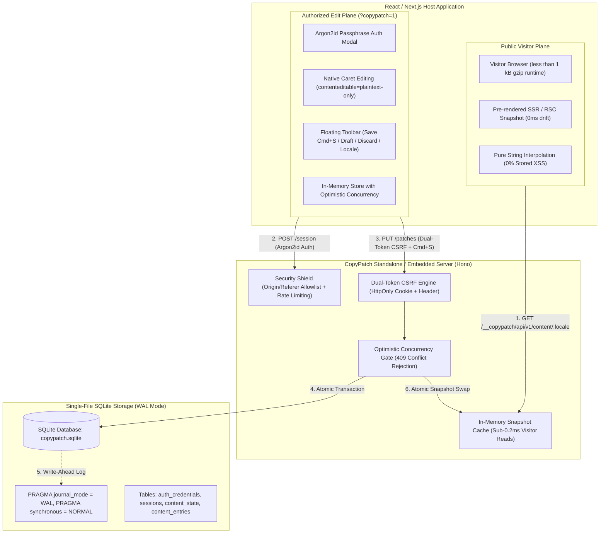
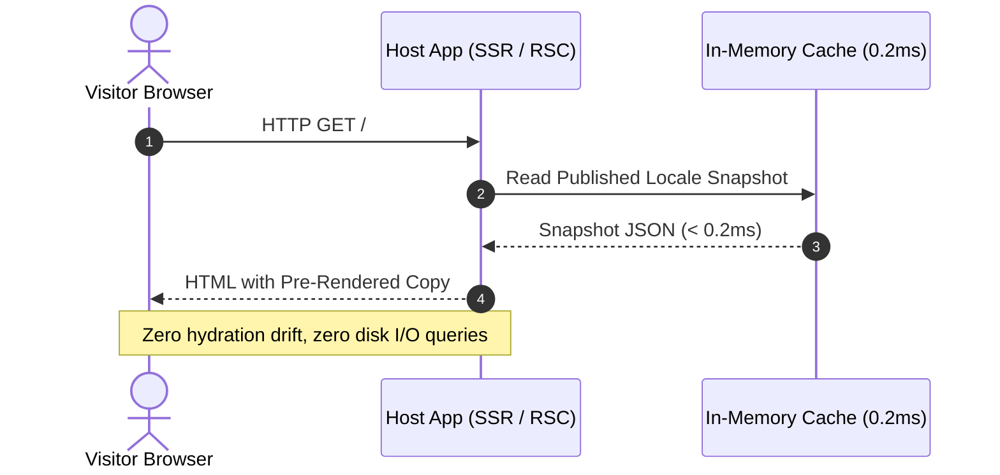
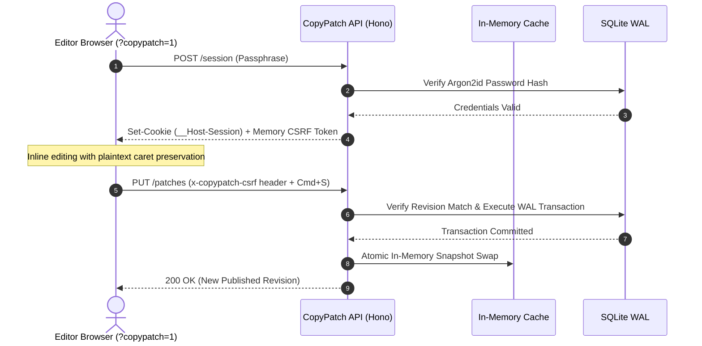

# CopyPatch System Architecture

CopyPatch is a lightweight, self-hosted inline copy editing architecture for React and Next.js applications.

---

## 1. High-Level Architecture



---

## 2. Execution Sequences

### Public Visitor Request Flow (Sub-0.2ms)



### Authorized Editor Flow (`?copypatch=1`)



---

## 3. Database Schema & Pragmas

CopyPatch initializes SQLite via `better-sqlite3` with high-concurrency pragmas:

```sql
PRAGMA journal_mode = WAL;
PRAGMA synchronous = NORMAL;
PRAGMA foreign_keys = ON;
PRAGMA busy_timeout = 5000;
PRAGMA cache_size = -64000; -- 64MB memory allocation
```

### Table Definitions

| Table | Primary Key | Key Columns | Purpose |
| :--- | :--- | :--- | :--- |
| `auth_credentials` | `id` (default 1) | `password_hash`, `updated_at` | Stores Argon2id hash & salt. Exactly 1 row. |
| `sessions` | `token_hash` (SHA-256) | `csrf_token_hash`, `idle_expires_at`, `absolute_expires_at` | Ephemeral session tokens with idle timeout. |
| `content_state` | `locale` | `published_revision`, `draft_revision`, `updated_at` | Tracks independent revision counters per language. |
| `content_entries` | `id` (Auto-inc) | `key`, `locale`, `published_text`, `draft_text`, `updated_at` | Holds actual plain-text copy strings keyed by `(key, locale)`. |

---

## 4. Failure Modes & Recovery Strategies

| Failure Scenario | System Response | Recovery Mechanism |
| :--- | :--- | :--- |
| **Concurrent Edit Collision** | Server returns `409 Conflict (REVISION_CONFLICT)` | Client UI prompts editor to fetch latest snapshot, diff changes, and save safely without overwriting. |
| **Backend Unreachable / Network Offline** | Provider falls back to hardcoded default text in JSX | Zero blank screens or fatal errors for visitors. Editor displays offline retry toast. |
| **Power Loss / Node Crash** | SQLite WAL file automatically recovers on next startup | Uncommitted transactions roll back cleanly; committed transactions persist safely. |
| **Database File Lock Contention** | `PRAGMA busy_timeout = 5000` retries lock up to 5 seconds | Concurrent write requests queue gracefully without throwing immediate `SQLITE_BUSY` errors. |
